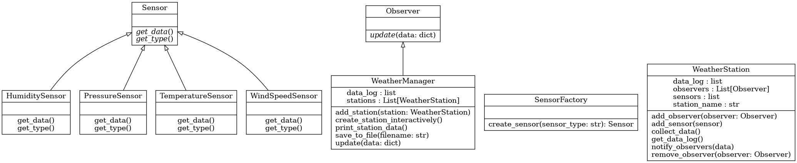

# Weather_Station_Project

Это проект по дисциплине "Объектно Ориентированное Программирование".

Задача:
Создать систему для сбора, хранения и анализа данных о погоде с различных метеостанций. Должна быть возможность добавлять новые станции, которые отправляют данные, такие как температура, влажность, давление и скорость ветра. Система должна уметь агрегировать и визуализировать данные в файле. При добавлении новой станции пользователь должен узнать о значениях датчиков новой станции. У метеостанций могут быть разные датчики температуры, влажности и тд.

В коде необходимо реализовать: 
Паттерн "Наблюдатель" для получения обновлений от метеостанций, "Компоновщик" для работы с данными разных типов (температура, влажность, и т.д.), паттерн "Фабрика" для создания объектов станций и датчиков.

1. Паттерн Наблюдатель
Ключевая идея: позволяет объектам (наблюдателям) автоматически получать уведомления о событиях в другом объекте (наблюдаемом объекте).
Observer
    • Это абстрактный класс (интерфейс), определяющий метод update(data: dict), который должен реализовать любой наблюдатель.
    • Наблюдатели будут уведомляться, когда метеостанция собирает новые данные.
WeatherStation
    • Отвечает за управление сенсорами (датчиками) и уведомление наблюдателей.
    • Методы:
        ◦ add_sensor(sensor): добавляет датчик к станции.
        ◦ add_observer(observer): регистрирует наблюдателя.
        ◦ remove_observer(observer): удаляет наблюдателя.
        ◦ collect_data(): собирает данные со всех датчиков, сохраняет их в data_log и уведомляет наблюдателей через notify_observers(data).
        ◦ get_data_log(): возвращает историю всех собранных данных.

2. Паттерн Фабрика
Ключевая идея: позволяет создавать объекты (датчики) без привязки к конкретным классам.
Sensor
    • Абстрактный класс (интерфейс) для всех типов датчиков. Определяет два метода:
        ◦ get_data(): возвращает данные с датчика.
        ◦ get_type(): возвращает тип датчика.
TemperatureSensor, HumiditySensor, PressureSensor, WindSpeedSensor
    • Реализации интерфейса Sensor. Каждый класс:
        ◦ Определяет метод get_data(), возвращающий случайные данные в заданном диапазоне.
        ◦ Определяет метод get_type(), возвращающий тип датчика.
SensorFactory
    • Содержит метод create_sensor(sensor_type: str), который создает и возвращает нужный тип датчика в зависимости от входного параметра:
        ◦ Например, "T" создаст TemperatureSensor, а "H" — HumiditySensor.
    • Если тип датчика не известен, выбрасывается ошибка ValueError.

3. Паттерн Компоновщик
Ключевая идея: позволяет работать с группой объектов (метеостанциями) как с единым объектом.
WeatherManager
    • Управляет метеостанциями и хранит собранные данные.
    • Реализует интерфейс Observer, что позволяет ему получать обновления от метеостанций.
    • Методы:
        ◦ add_station(station): добавляет метеостанцию и регистрируется как её наблюдатель.
        ◦ update(data: dict): вызывается при уведомлении от станции, добавляет данные в общий лог.
        ◦ save_to_file(filename: str): сохраняет все данные в файл.
        ◦ create_station_interactively(): позволяет пользователю интерактивно создать станцию и добавить к ней датчики.
        ◦ print_station_data(): выводит все собранные данные для каждой станции.

4. Основной код
    • Основной цикл программы предоставляет пользователю следующие функции:
        1. Создать новую станцию: Вызывает create_station_interactively, чтобы пользователь ввёл имя станции и добавил нужные датчики.
        2. Собрать данные со всех станций: Каждая станция собирает данные со своих датчиков и уведомляет наблюдателя (менеджера).
        3. Сохранить данные в файл: Данные сохраняются в файл, введённый пользователем.
        4. Показать данные всех станций: Выводится история данных для каждой станции.
        5. Выйти: Завершение программы.

Пример работы
    1. Пользователь выбирает действие "Создать новую станцию".
        ◦ Вводит имя станции, например, "Station1".
        ◦ Добавляет датчики, вводя их типы (например, T, H, P).
    2. После создания станции, пользователь выбирает "Собрать данные".
        ◦ Система собирает данные с каждого датчика станции.
    3. Пользователь может сохранить данные в файл.
    4. Пользователь просматривает собранные данные всех станций.

Почему это полезно
    • Модульность: Каждый компонент отвечает за свою задачу (наблюдатели, фабрика, станции).
    • Расширяемость: Легко добавить новые типы датчиков или новые функции.
    • Переиспользование: Один менеджер может управлять несколькими станциями, а одна фабрика создавать разные типы датчиков.

UML-диаграмма:

